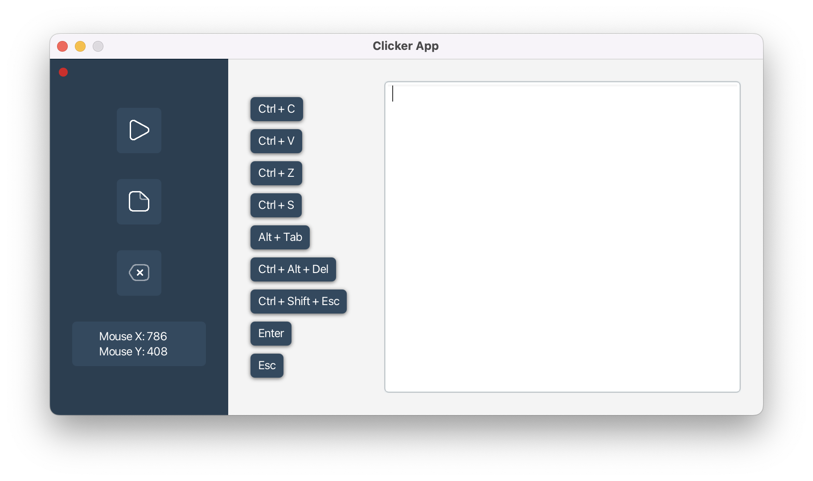

# Clicker

*Clicker* is a cross-platform Java desktop application that automates user-defined tasks by executing scripts. It can control both mouse and keyboard actions, allowing precise and repeatable sequences of operations.

Platforms: macOS (Windows and Linux support planned)



---

## Features

- Script-based automation for mouse and keyboard
- Commands include: moving the cursor, clicking buttons, pressing/releasing keys, waiting, and repeating blocks
- Supports loops and repeat blocks for complex sequences
- Tracks mouse coordinates for accurate scripting
- Stop execution immediately by moving the mouse

Future plans:

- Typing entire sentences
- Looping cycles
- Linux installer

---

## Installation

Clicker comes with installers for ~~Windows~~ and macOS. Installation is straightforward: just run the installer for your platform.

---

## Usage

1. Load a script from a .txt file using the Load Script button.
2. The script will appear in the script area. Ensure it follows the correct syntax.
3. Click Start to execute the script. Execution status is indicated by a small red/green circle in the top-left corner of the window.
4. Click Erase to clear the script area (this action cannot be undone).
5. Use the Tracking Cursor section to capture coordinates for scripts.

---

## Script Commands

### Mouse & Keyboard Commands

```
WAIT 2000        # waits 2 seconds
MOVE 200,300     # moves cursor to X=200, Y=300
CLICK LEFT       # left mouse click
PRESS SHIFT      # press the SHIFT key
RELEASE SHIFT    # release the SHIFT key
REPEAT 5         # repeat the block 5 times
END              # marks the end of a repeat block
```

- Correct button/key names for `CLICK`, `PRESS`, and `RELEASE` are:  
  `LEFT`, `RIGHT`, `MIDDLE`, `A-Z`, `0-9`, `ENTER`, `SHIFT`, `CONTROL`, `ALT`, `PAGE_DOWN`/`PAGE_UP`, `F1-F24`, `ESCAPE`, `HOME`, `END`, `WINDOWS`, `BACK_SPACE`, `DELETE`, `INSERT`, `TAB`, `NUMPAD0-NUMPAD9`

- macOS key mappings differ slightly (e.g., `CONTROL` → `Control ^`, `ALT` → `Option ⌥`, `META` → `Command ⌘`).

Tip: Include a short WAIT at the start of scripts to give yourself time to move the mouse if needed.

By combining these commands, you can create precise, repeatable sequences for any task. Always test your scripts carefully.

The full manual is also available on the [Clicker website](https://leprpht.github.io/ClickerWeb/).

---